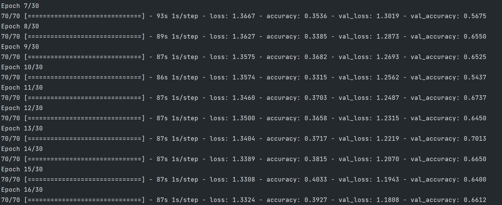
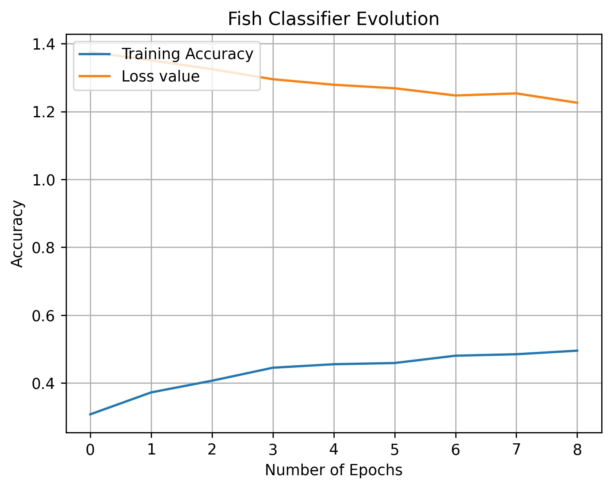
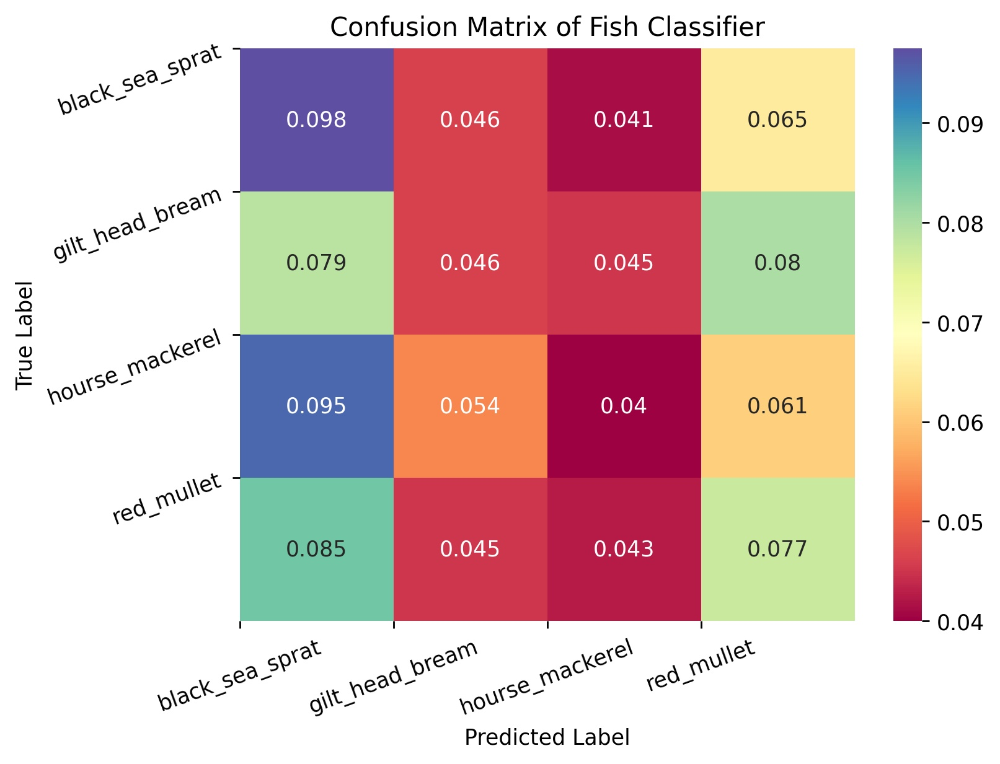

# NEURAL NETWORK FISH CLASSIFIER

## Introduction

This is an implementation of a convolutional neural network that is able to classify groups of fish.
The dataset has got four different fish classes, each one composed of 1000 images, and they have been
obtained from a Kaggle dataset (see https://www.kaggle.com/crowww/a-large-scale-fish-dataset).

## Results

* ### Training Output

* ### Accuracy and Loss Evolution

* ### Confusion Matrix

## Hyperparameters and Parameters

* ### Dataset initializer
  
| Name  | Definition | Value |
| ----  | ---------- | ----- | 
| Training percentage | Amount of files for training in % | 80% |
| Validation percentage | Amount of files for validation in % | 20% |

* ### Neural network Compilation

| Name  | Definition | Value |
| ----  | ---------- | ----- |
| Loss function | Loss function used during training | Categorical Cross Entropy |
| Optimizer | Optimizer used during training | Ada Delta |

* ### Training and EarlyStopping

| Name  | Definition | Value |
| ----  | ---------- | ----- |
| Number of Epochs | Maximum number of iterations | 10 |
| Steps per Epoch  | Total steps of each epoch executed | 70 |
| Batch size | Number of files loaded during training steps | 30 |
| Patience   | Maximum tries to improve val_accuracy before exit | 3 |

* ### Data Augmentation

| Name  | Definition | Value |
| ----  | ---------- | ----- |
| Target size | Width and height for each image loaded | 200w, 200h |
| Rescale | Rescale used during image loading process | 1./255 |
| Rotation range | Rotation range for data augmentation | 30 |
| Zoom range | Zoom range for data augmentation | 0.7 |
| Width shift range | Width swift range for data augmentation | 0.1 | 
| Height shift range | Width swift range for data augmentation | 0.1 |
| Brightness range | Brightness range for data augmentation | (0.2, 0.8) |
| Horizontal flip | Horizontal flip for data augmentation | True |
| Vertical flip | Vertical flip for data augmentation | True |

## Authors

- losedavidpb: [https://github.com/losedavidpb](https://github.com/losedavidpb)
- SergioULPGC: [https://github.com/SergioULPGC](https://github.com/SergioULPGC)
